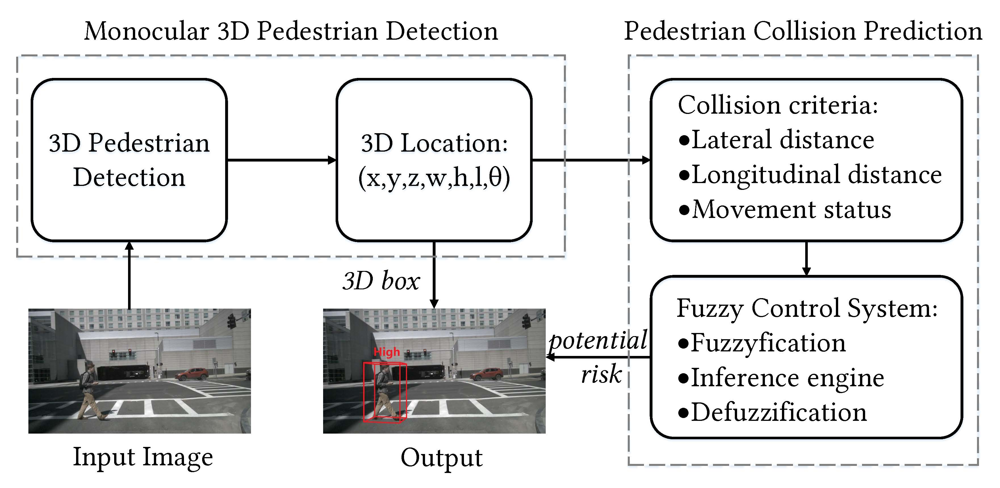
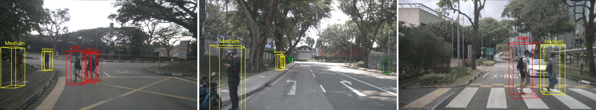

# PedView
This repo contains the implementations of PedView and nuscenes-collision dataset. Our implementations are built on top of MMdetection3D.

  

## Data
### NuScenes
Follow the MMDetection3d to process the data.
### NuScenes-collision
[Baidu Netdisk](https://pan.baidu.com/s/1UGetJtV7I1sJ8Sn8FPr6MA?pwd=oyxj) | [Google drive](https://drive.google.com/file/d/1NcYtd8SgIoruG4gLn6y2v-XxSXkt8B92/view?usp=sharing)  

  

## Usage
Follow the [FCOS3D](https://github.com/open-mmlab/mmdetection3d/tree/v1.0.0rc6/configs/fcos3d) to use the monocular 3d detector.

## Results and models
### NuScenes
| Backbone | AP | ATE (m) | AAE (1-acc) | Download |
| :---------: | :----: | :----: | :------: | :------: |
|[Swin-small](./projects/configs/obj_dgcnn/pillar.py)| 0.4284 | 0.6820 | 0.1664 |[Baidu](https://pan.baidu.com/s/11hjM_yLIc-RNOhbKTXziQA?pwd=4o82) &#124; [Google](https://drive.google.com/file/d/1PTcmxeo2ik7eySYvn45xLzqOdyoGvxBw/view?usp=sharing)|
### NuScenes-collision
| Method | Precision | Recall |
| :---------: | :----: | :----: |
| PedView | 0.937 | 0.835 |

